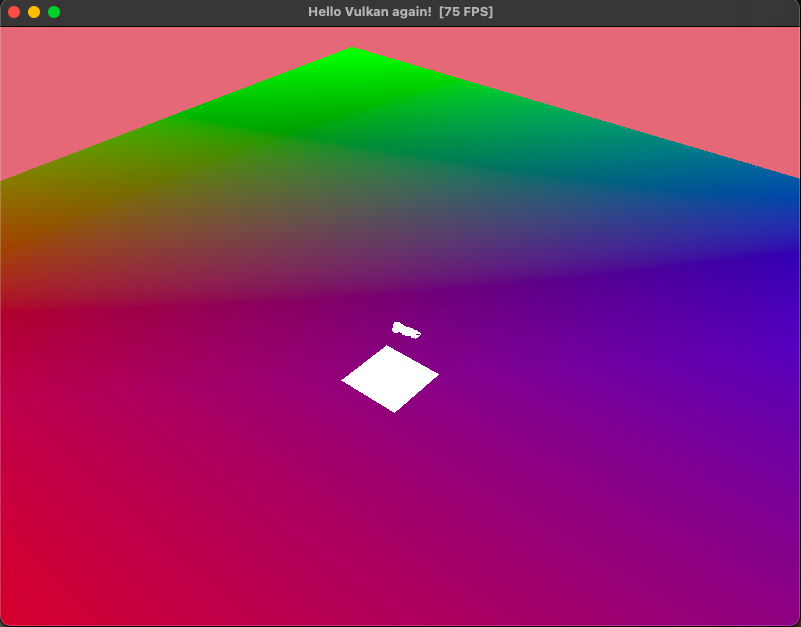
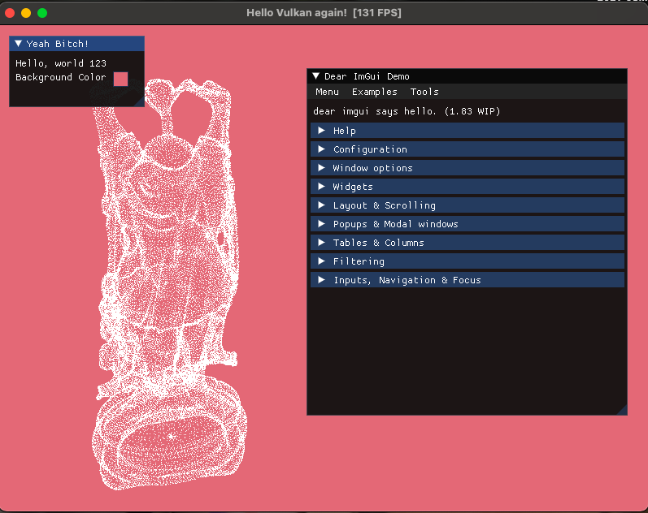
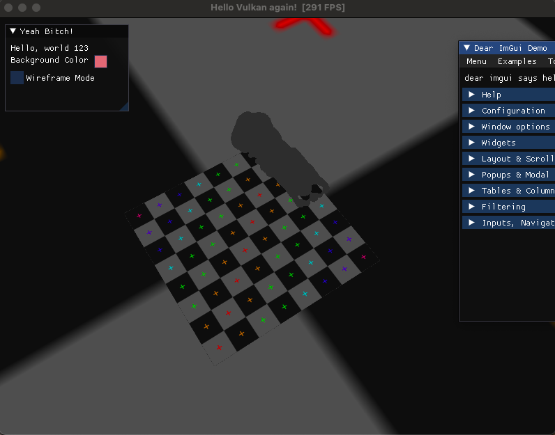
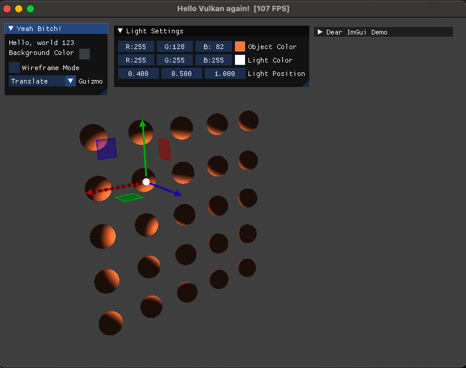

# Hello Vulkan

This is a simple Vulkan Sandbox to learn the basics of the Vulkan API from the tutorial by
[Alexander Overvoorde's Vulkan tutorial](https://vulkan-tutorial.com/).

### Features
- Vulkan objects Abstracted into reusable units
    - Create Renderpasses in one go
    - Create reusable command buffers
    - Easy to use VertexBuffer, IndexBuffer and UniformBuffer objects
    - Model loading + Cramped up Texture mapping in uniform buffers(This needs refactoring to be more user friendly)
    - Diffuse and ambient lighting demo scene with okayish ImGuizmo
- Simple Camera system to move around the scene
- **ImGui Integration** that works out of the box and helps you integrate into your Vulkan app in a matter of few minutes

#### TODO Features:
- Better Descriptor sets API for uniform buffers
- Automatic Uniform buffer management using SPIRV-Reflect
- Better renderpass and subpass management API for postFX + default PostFX effects ready to use
- Multithreaded Command buffer recording and execution model

This sandbox has a very simple and brief ImGui integration that makes it easy to use while extending your potentially modified version of Alexander Overvoorde's hello triangle Application (I had a hard time undestanding the tutorials of [frguthmann](https://frguthmann.github.io/posts/vulkan_imgui/) and [SaschaWillems](https://github.com/SaschaWillems/Vulkan/blob/master/examples/imgui/main.cpp) examples on the web while extending from the hello triangle, since none of them actually use Alexander Overvoorde's hello triangle), it doesn't use any `ImGui_Impl_VulkanH` functions, only uses the ImguiImplVulknan backend files to make the integration as smooth and simple as possible with existing rendering.

## Screenshots





### ImGUI Integration in a nutshell
- Create a descriptor pool with different size as provided in [frguthmann](https://frguthmann.github.io/posts/vulkan_imgui/) tutorial, next use a single time command buffer to upload the font to GPU using a single queueSubmit. Next create multiple command buffers for each swapchain image and use ImGUI spedicif renderpass also explained how to do by frguthmann and in the DrawFrame submit 2 commandBuffers combined in an array and Voila you have Dear ImGui!

**Tip:** _If your ImGui is looking pale or bleached out, change swap surface format from `VK_FORMAT_R8G8B8A8_SRGB` to `VK_FORMAT_R8G8B8A8_UNORM` and it should look fine._

## Building

(Assuming you have the environment variable `VULKAN_SDK` pointing to the SDK)

Use the CMake to build the application (currently only works )

```shell
mkdir build
cd build
cmake ..
make run
```

Once built, the program can be run from within the build directory using the `make run` command (even for changes)

For compiling the shaders use `./../src/shaders/glsl/compile-glsl.sh` from within the build directory (if you get permission erros use `chmod +x ../src/shaders/glsl/compile-glsl.sh` before running the shell script)

## Thanks to
*  [Alexander Overvoorde](https://vulkan-tutorial.com/) for his awesome Vulkan tutorial.
* [frguthmann](https://frguthmann.github.io/posts/vulkan_imgui/) for his awesome ImGui integration blog
* [SaschaWillems](https://github.com/SaschaWillems/Vulkan/blob/master/examples/imgui/main.cpp) for his examples
* [ocornut](https://github.com/ocornut/imgui) for Dear ImGui backend and example files
